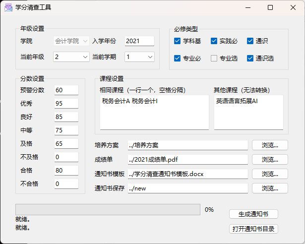

# CreditCheck

#### 介绍

自动解析pdf格式的培养方案和pdf格式的成绩单，生成学分清查通知单。（适用于武汉纺织大学会计学院)

[https://gitee.com/yangjywhu/CreditCheck](https://gitee.com/yangjywhu/CreditCheck)

#### 软件架构

- 使用[Python](https://www.python.org/)作为开发语言。
- 使用[pdfplumber](https://github.com/jsvine/pdfplumber)模块读取PDF文件信息。
- 使用[openpyxl](https://foss.heptapod.net/openpyxl/openpyxl)写入Excel。
- 使用[docxtpl](https://github.com/elapouya/python-docx-template)模块根据已有的Word模板生成独立的Word文档。
- 使用[PySide6](https://wiki.qt.io/Qt_for_Python)编写用户界面。
- 使用[pyinstaller](https://github.com/pyinstaller/pyinstaller)打包成不需额外安装Python解释器和相应模块的程序包。

已在如下版本中测试（参见[requirements.txt](requirements.txt)）：

```
python==3.11.3
docxtpl==0.16.7
openpyxl==3.1.2
pdfplumber==0.9.0
PySide6==6.5.0
pyinstaller==5.10.1
```

#### 安装教程

如果使用powershell，需要在管理员状态下输入：

```powershell
Set-ExecutionPolicy RemoteSigned
```

安装：

```powershell
# 删除已存在文件
rm -r .\build
rm -r .\dist
rm -r .\env

# 创建虚拟环境并打包
python -m venv env
.\env\Scripts\activate
pip install -r requirements.txt
pyinstaller -w -i .\doc\icons\icon.ico .\src\main.py

# 删除不需要的文件并生成启动脚本
.\bin\remove_not_use.bat
copy .\bin\start.bat .\dist\学分清查工具.bat

```

如果出现以下的提示，输入 `y`。

```plaintext
WARNING: The output directory "X:XXX\...\dist\main" and ALL ITS CONTENTS will be REMOVED! Continue?
```

将 `dist`目录下的 `main`和 `学分清查工具.bat`打包即可发布

#### 使用说明



请点击【生成通知书】开始运行程序。完成后，点击【打开通知书目录】查看生成的通知书所在文件夹。

- **年级设置**：当前年级1为大一，2为大二，以此类推；当前学期1为上学期，2为下学期。
- **必修类型**：勾选的课程类型中，每一门课程会检查是否已修完并及格。如果成绩单中的课程名称（不包含字母）与培养方案相同，且学分大于或等于培养方案中该门课程的学分，则可以通过检查；如不符合则视为未修，请通知学生检查该门课程是否已转换成功。
- **分数设置**：请正确输入等次成绩与百分制分数的对应关系。如果某门课的分数低于预警分数，则视为挂科，该门课的学分不能记录。
- **相同课程**：已自动进行一些转换。但有一些相同的课程不符合此规则，一般为院内不同专业的可成，如默认所示，如有其他情况可添加。已进行的转换如下：
  * 同一门课不同等次：如【高等数学A(I)】和【高等数学B(I)】。**需要申请转换**。
  * 相同学期的体育课：2022学年以前的体育课名称带有内容，但之后的不带内容。如【体育I】和【体育I(养生)】。不需要申请转换。
  * 英语和二外：【二外I(日语)】与【大学基础英语B1】，**需要申请转换**。
- **其他课程**：目前暂无法转换的课程，只能归为“其他课程”，不参与学分的计算，如默认值所示。
- **培养方案**：包含pdf格式的培养方案的文件夹，文件名格式为【年级+专业代码+专业名称.pdf】，如【20211621_会计学.pdf】。
- **成绩单**：所有人成绩单的pdf，注意是单个文件，每一页是一名同学的成绩单。
- **通知书模板**：docx格式的Word文档，双大括号中的内容将会被替换。请参考示例文档。
- **通知书保存**：每人一个Word文档，文件名为【班级_姓名.docx】。

输出文件夹中，`Summary.xlsx`是所有学生的学分清查结果总结，有如下几列（对应Word中双大括号中的内容）：

- **班级**
- **姓名**
- **学号**
- **专业必完成科目**：已完成的属性为“专业必”的具体科目。用以计算GPA。
- **专业必GPA**：【专业必完成科目】中的所有课程的GPA。
- **必修课转换**：不完全相同的必修课，**需要申请转换**，提醒学生检查是否已完成转换。
- **专业选完成科目**：主动选择的专业选修课，和转专业后不能转换到相应必修课的课程。
- **选修课转换**：转换失败而从必修课转变为专业选修课的课程，**需要申请转换**，提醒学生检查是否已完成转换。
- **必须完成的类型**：在【必修类型】里勾选的课程类型，培养方案中的这些类型的课程必须每一门都修完。
- **必修未完成数目**：【必修类型】中未选或挂科的课程数目。
- **必修未完成科目**：【必修类型】中未选或挂科的课程列表。
- **专业选应**：培养方案中规定的应修的专业选修课学分。
- **专业选实**：实际已修的专业选修课科目，包含需要申请转换和不需要申请转换的课程。
- **通识选应**：培养方案中规定的应修的通识选修课学分，包含必须选的【英语语言拓展】，但目前该门课程无法转换，需要等待进一步通知。
- **通识选实**：实际已修的通识选修课科目。

## 更新日志

### v0.1.2

- 将带括号的体育（如：【体育I(养生)】）去除括号，不用申请转换。
- 将“二外”与“大学基础英语”比对，并标注需要申请转换。
- 培养方案和成绩单中的①名称、②学分、③类型不完全相同的，需要提醒转换，标记为 `diff`，并将培养方案中的课程这三项赋值给成绩单中的相应课程。本次更新使得③可以正常识别并替换，尤其是其他专业的专业必修课是本专业的专业选修课的情况。
